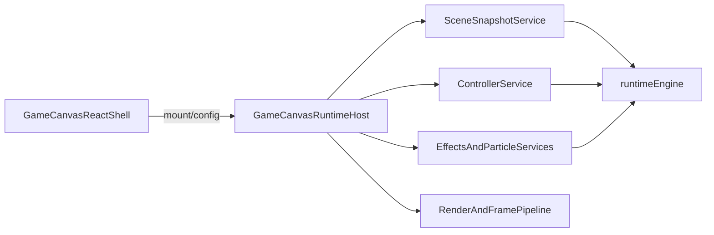

# Runtime Host Endgame Plan

## Goal

Move snapshot-producing canvas/runtime adapters out of React and into long-lived host-owned services, so `[client/src/components/GameCanvas.tsx](client/src/components/GameCanvas.tsx)` becomes mostly a shell around the DOM canvas, overlay composition, and host lifecycle.

Current reality:

- `GameCanvasRuntimeHost` already owns render context, frame bindings, and typed snapshots in `[client/src/engine/runtime/GameCanvasRuntimeHost.ts](client/src/engine/runtime/GameCanvasRuntimeHost.ts)`.
- React still produces those snapshots through hooks like `[useGameCanvasSceneRuntime](client/src/engine/runtime/useGameCanvasSceneRuntime.ts)`, `[useGameCanvasControllerRuntime](client/src/engine/runtime/useGameCanvasControllerRuntime.ts)`, `[useGameCanvasParticleRuntime](client/src/engine/runtime/useGameCanvasParticleRuntime.ts)`, and syncs them with `[useGameCanvasHostSyncRuntime](client/src/engine/runtime/useGameCanvasHostSyncRuntime.ts)`.

## End-State Shape

## Stage 1: Remove Sync-Only Adapters

Replace the React-only sync glue with host methods/services first, because this is the lowest-risk slice.

Files:

- `[client/src/engine/runtime/useGameCanvasHostSyncRuntime.ts](client/src/engine/runtime/useGameCanvasHostSyncRuntime.ts)`
- `[client/src/engine/runtime/useGameCanvasControllerBridgeRuntime.ts](client/src/engine/runtime/useGameCanvasControllerBridgeRuntime.ts)`
- `[client/src/components/GameCanvas.tsx](client/src/components/GameCanvas.tsx)`
- `[client/src/engine/runtime/GameCanvasRuntimeHost.ts](client/src/engine/runtime/GameCanvasRuntimeHost.ts)`

Plan:

- Move snapshot/frame-binding assembly behind explicit host methods like `updateSceneSnapshot()`, `updateControllerSnapshot()`, `updateAmbientEffects()`, or a single `syncFromReactAdapters()` method on the host.
- Delete or collapse the thin React-only bridge hooks once the host can accept already-shaped inputs directly.
- Keep `GameCanvas` as the place that mounts/configures the host, but stop using multiple intermediate adapter hooks purely for host synchronization.

## Stage 2: Move Tiny Controller Adjunct State Behind Host Services

Pull the small controller-owned adjuncts into host-managed controller services before touching the hardest controller logic.

Files:

- `[client/src/engine/runtime/useGameCanvasControllerRuntime.ts](client/src/engine/runtime/useGameCanvasControllerRuntime.ts)`
- `[client/src/hooks/useGameCanvasUpgradeMenuState.ts](client/src/hooks/useGameCanvasUpgradeMenuState.ts)`
- `[client/src/hooks/useGameCanvasHostState.ts](client/src/hooks/useGameCanvasHostState.ts)`
- `[client/src/engine/runtime/assembleGameCanvasControllerSnapshot.ts](client/src/engine/runtime/assembleGameCanvasControllerSnapshot.ts)`

Plan:

- Turn upgrade menu state and host-state shaping into host/controller-owned mutable services.
- Reduce the controller snapshot to service outputs instead of React-local hook composition.
- Preserve the current typed controller snapshot contract while swapping who produces it.

## Stage 3: Move Ambient/Effects Services Out of React

The host already has enough typed inputs for this, so it is the best next producer migration after sync glue.

Files:

- `[client/src/engine/runtime/useGameCanvasEffectsRuntime.ts](client/src/engine/runtime/useGameCanvasEffectsRuntime.ts)`
- `[client/src/engine/runtime/useGameCanvasRuntimeEffects.ts](client/src/engine/runtime/useGameCanvasRuntimeEffects.ts)`
- `[client/src/engine/runtime/useGameCanvasEnvironmentRuntime.ts](client/src/engine/runtime/useGameCanvasEnvironmentRuntime.ts)`
- `[client/src/engine/runtime/gameplayEventEffectsRuntime.ts](client/src/engine/runtime/gameplayEventEffectsRuntime.ts)`

Plan:

- Convert ambient/effects behavior from hook-backed bridges into host-owned services with explicit `start/stop/update` lifecycles.
- Reuse existing non-React service patterns from `[client/src/engine/runtime/gameplaySubscriptionsRuntime.ts](client/src/engine/runtime/gameplaySubscriptionsRuntime.ts)` and `[client/src/engine/runtime/worldChunkDataRuntime.ts](client/src/engine/runtime/worldChunkDataRuntime.ts)`.
- Leave only effect configuration and browser lifecycle attachment in React if needed.

## Stage 4: Move Particle Production Into Host-Owned Services

Particle production is already well isolated and should become a host service after ambient effects.

Files:

- `[client/src/engine/runtime/useGameCanvasParticleRuntime.ts](client/src/engine/runtime/useGameCanvasParticleRuntime.ts)`
- `[client/src/engine/runtime/GameCanvasRuntimeHost.ts](client/src/engine/runtime/GameCanvasRuntimeHost.ts)`

Plan:

- Replace the hook-driven particle snapshot with a host-owned particle service consuming scene/controller state.
- Keep the existing typed particle snapshot as the host-facing render contract.
- Ensure render code in `[client/src/engine/runtime/useGameCanvasRenderRuntime.ts](client/src/engine/runtime/useGameCanvasRenderRuntime.ts)` reads the same stable particle surface.

## Stage 5: Move Render-Context Assembly Behind Host Configuration

At this point, React should stop assembling the large render input bag each render.

Files:

- `[client/src/engine/runtime/useGameCanvasRenderRuntime.ts](client/src/engine/runtime/useGameCanvasRenderRuntime.ts)`
- `[client/src/engine/runtime/GameCanvasRuntimeHost.ts](client/src/engine/runtime/GameCanvasRuntimeHost.ts)`
- `[client/src/components/GameCanvas.tsx](client/src/components/GameCanvas.tsx)`

Plan:

- Push render-context assembly into the host so React passes only stable config/assets/DOM refs.
- Keep browser-bound assets and DOM refs configured from React, but stop recomputing the full render context in a hook.
- End target: render hook becomes either tiny config glue or disappears entirely.

## Stage 6: Migrate Core Controller Behavior

This is one of the largest remaining ownership seams and should happen after effects/render are already host-owned.

Files:

- `[client/src/engine/runtime/useGameCanvasBuildState.ts](client/src/engine/runtime/useGameCanvasBuildState.ts)`
- `[client/src/engine/runtime/useGameCanvasInteractionRuntime.ts](client/src/engine/runtime/useGameCanvasInteractionRuntime.ts)`
- `[client/src/engine/runtime/useGameCanvasFrameRuntimeState.ts](client/src/engine/runtime/useGameCanvasFrameRuntimeState.ts)`
- `[client/src/engine/runtime/movementPredictionRuntime.ts](client/src/engine/runtime/movementPredictionRuntime.ts)`

Plan:

- Extract build/interaction logic into imperative controller services owned by the host.
- Use the existing runtime-owned movement precedent in `[client/src/engine/runtime/movementPredictionRuntime.ts](client/src/engine/runtime/movementPredictionRuntime.ts)` as the design model.
- Keep React limited to event capture and minimal subscriptions.

## Stage 7: Migrate Scene Production Last

This is the heaviest and riskiest migration because it still owns table reads, interpolation, mouse/world lookup work, and frame assembly.

Files:

- `[client/src/engine/runtime/useGameCanvasSceneRuntime.ts](client/src/engine/runtime/useGameCanvasSceneRuntime.ts)`
- `[client/src/engine/runtime/assembleGameCanvasSceneSnapshot.ts](client/src/engine/runtime/assembleGameCanvasSceneSnapshot.ts)`
- `[client/src/engine/frame/useFrameAssembly.ts](client/src/engine/frame/useFrameAssembly.ts)`
- `[client/src/engine/runtime/useGameplayTableStateRegistry.ts](client/src/engine/runtime/useGameplayTableStateRegistry.ts)`
- `[client/src/engine/adapters/spacetime/createGameplayTableBindings.ts](client/src/engine/adapters/spacetime/createGameplayTableBindings.ts)`
- `[client/src/engine/runtimeEngine.ts](client/src/engine/runtimeEngine.ts)`

Plan:

- Move scene producers toward long-lived runtime stores/services backed by `runtimeEngine` rather than React hooks.
- Replace hook-local interpolation and lookup production with host/service-owned caches or runtimeEngine slices.
- Expect this stage to require the most coordination with table binding/state registry architecture.

## Risks

- `[client/src/engine/runtimeEngine.ts](client/src/engine/runtimeEngine.ts)` is a global singleton, so ownership boundaries need discipline to avoid accidental coupling.
- `[client/src/engine/runtime/useGameplayTableStateRegistry.ts](client/src/engine/runtime/useGameplayTableStateRegistry.ts)` and `[client/src/engine/adapters/spacetime/createGameplayTableBindings.ts](client/src/engine/adapters/spacetime/createGameplayTableBindings.ts)` still anchor a lot of gameplay state flow in React-shaped setters/refs.
- Controller/build/interaction migration is behavior-heavy and should not be attempted before the thinner sync/effects/render slices are done.

## Success Criteria

- `[client/src/components/GameCanvas.tsx](client/src/components/GameCanvas.tsx)` is reduced to host instantiation, DOM refs, stable config/assets, and overlay composition.
- `GameCanvasRuntimeHost` becomes the long-lived owner of canvas producers, not just the consumer of React-refreshed snapshots.
- React hooks stop being the refresher of scene/controller/effects runtime state and become primarily mount/config/subscription bridges.

